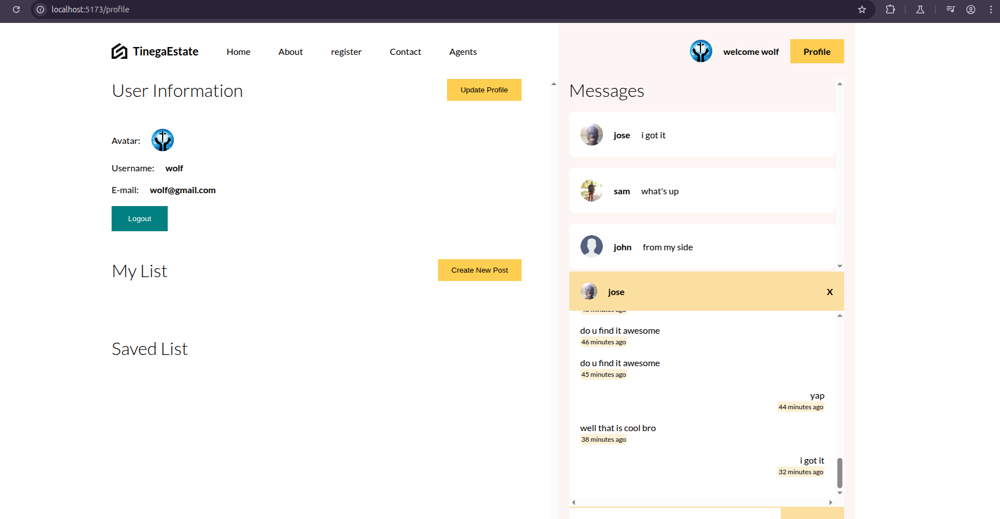

# 🏠 Tinega Real Estate App


A full-stack real estate web application that allows users to browse properties, post new listings, save favorite properties, and **chat directly with property owners** in real-time.

## ✨ Features

- 🔐 Authentication (Register, Login, Logout)
- 🏘️ Browse and filter real estate listings
- 💾 Save favorite listings to your profile
- ✍️ Property owners can post and manage their own listings
- 💬 Real-time chat between clients and property owners
- 📬 Notifications for unread messages
- 📸 Image upload for listings and profile avatars

## 🧰 Tech Stack

### Frontend
- React + Vite
- Zustand (State Management)
- React Router
- Axios
- SCSS

### Backend
- Node.js + Express
- MongoDB + Mongoose
- Cloudinary (Image Hosting)
- JSON Web Tokens (JWT) for authentication
- Socket.io for real-time chat

## 📦 Project Structure


## 🚀 Getting Started

### 1. Clone the repository

```bash
git clone https://github.com/YOUR_USERNAME/YOUR_REPO_NAME.git
cd Estate
cd client
npm install
cd ../Server
npm install
PORT=8080
MONGO_URI=your_mongodb_uri
JWT_SECRET=your_jwt_secret
CLOUDINARY_CLOUD_NAME=your_cloud_name
CLOUDINARY_API_KEY=your_api_key
CLOUDINARY_API_SECRET=your_api_secret
