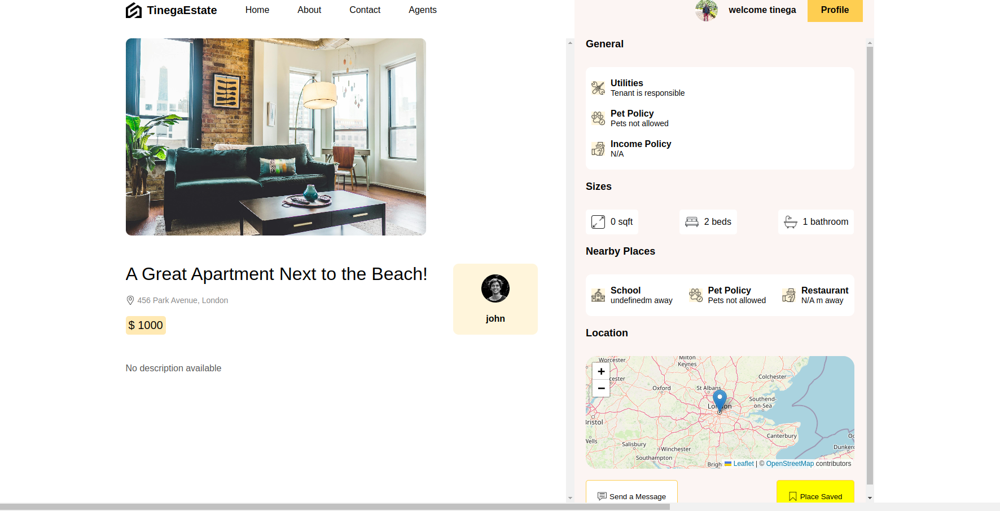

to interact with app  click https://67e02e0c3555b065cb703384--tinegarealestateapp.netlify.app/
# RealEstate App



## 📌 Overview

RealEstate App is a modern full-stack real estate platform that allows users to list, search, and manage properties efficiently. It utilizes a **React.js frontend** with **Zustand for state management**, and a **Node.js/Express backend** with **Prisma as ORM** for database interactions.

## 🚀 Features

- 🏡 **Property Listings** – Users can add and view real estate listings with images.
- 🗺️ **Interactive Maps** – Integrated **Leaflet.js** and **React-Leaflet** for location-based searches.
- 🔒 **Authentication & Security** – Secure user authentication using **JWT & bcrypt.js**.
- 🔄 **Real-time Updates** – Powered by **Socket.io** for instant property status updates.
- 💬 **Messaging System** – Chat between buyers and sellers.
- 🖼️ **Rich Text Editor** – Users can format descriptions with **React-Quill**.
- 📢 **Notifications** – Toast notifications with **React-Toastify**.
- 📅 **Time Ago Formatting** – Human-readable timestamps using **timeago.js**.

---

## 🏗 Tech Stack

### 🌐 **Frontend** (Client)
- React.js + Vite
- Zustand (State Management)
- React Router DOM
- React Icons
- React-Leaflet (Maps)
- React-Quill (Rich Text Editor)
- Sass (Styling)

### 🔧 **Backend** (API)
- Node.js & Express
- Prisma ORM + PostgreSQL/MongoDB
- JWT Authentication
- Bcrypt.js (Password Hashing)
- Cookie Parser
- CORS (Cross-Origin Resource Sharing)
- Dotenv (Environment Variables)

---

## 📦 Installation

### 1️⃣ **Clone the Repository**
```bash
git clone https://github.com/tinegachris-o/RealEstateApp.git
cd RealEstateApp
=======

# RealEstate

# Ignore Node.js dependencies
node_modules/
client/node_modules/
Api/node_modules/

# Ignore environment files
.env
client/.env
Api/.env

# Ignore build files
dist/
client/dist/
Api/dist/

# Ignore logs
logs/
*.log
npm-debug.log*
yarn-debug.log*
yarn-error.log*

# Ignore system files
.DS_Store
Thumbs.db

